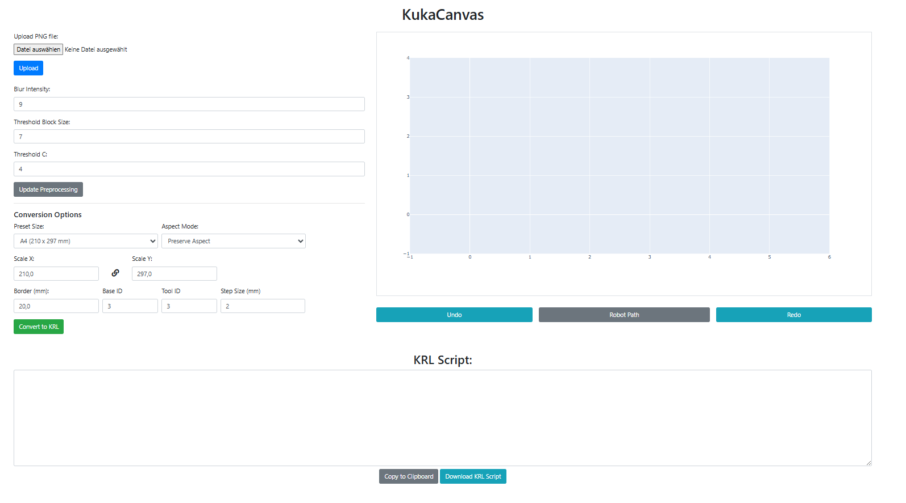

# KUKACanvas

KUKACanvas is a Python-based tool that converts images into movement instructions for KUKA robots, enabling automated drawing or sketching. It provides an interface for image processing, contour detection, and the generation of robot code compatible with KUKA controllers.

## Features

- Converts images to robot movement commands (e.g., KRL `.src` files)
- Image preprocessing: grayscale conversion, blurring, adaptive thresholding
- Plotting of contours and robot pathing
- Contour removing by clicking on the contour plot
- Contour detection and smoothing
- Contour interpolation and closure for continuous drawing paths
- Self-hosted web interface for image upload and conversion to KRL code

## Requirements

Install dependencies:
```
pip install opencv-python numpy pillow scikit-image flask flask_session plotly pandas
```

## Usage

1. Place your input image in the project directory.
2. Use the `process_image` function in `website/image_stuff/image_conversion.py` to process the image and extract contours:
   ```python
   from website.image_stuff.image_conversion import process_image

   contours = process_image('your_image.png', blur=5, blockSize=11, C=2)
   ```
3. Use the resulting contours to generate KUKA robot movement commands (see `draw.src` for example output).

## KRL Code Generation
Every contour is represented as a series of points. The code generation function takes these points and formats them into KUKA Robot Language (KRL) commands. The generated code includes:
- Initialization of the robot's base and tool
- Setting the robot's position to a home position
- Movement commands for each contour, including linear and circular movements
- Wait commands to control the speed of the drawing process
- Closing the contours to ensure continuous drawing
- Returning to the home position after completing the drawing
- Comments to indicate the start and end of each contour


A generated KUKA `.src` file will contain lines like with `{base_id}` and `{tool_id}` replaced with actual values:
```
&ACCESS RVP 
&REL 1 

DEF DRAW() 

POS p_home 
p_home = {X 0.00, Y 0.00, Z 10.00, A 0, B 0, C 0} 

BAS(#initmov, 0) 
BAS(#tool, {tool_id}) 
BAS(#base, {base_id}) 

PTP $axis_act 

PTP p_home

; ----- Contour 1 -----
PTP {X 112.68, Y 204.61, Z 10.00, A 0, B 0, C 0}
LIN {X 112.68, Y 204.61, Z 0.00, A 0, B 0, C 0}
WAIT SEC 0.1

LIN {X 114.64, Y 204.61, Z 0.00, A 0, B 0, C 0} C_DIS
LIN {X 116.60, Y 204.61, Z 0.00, A 0, B 0, C 0} C_DIS
.
.
.
LIN {X 112.37, Y 204.77, Z 10.00, A 0, B 0, C 0}
; ----- Contour 2 -----
.
.
.
PTP p_home
END
```

## Web Interface

